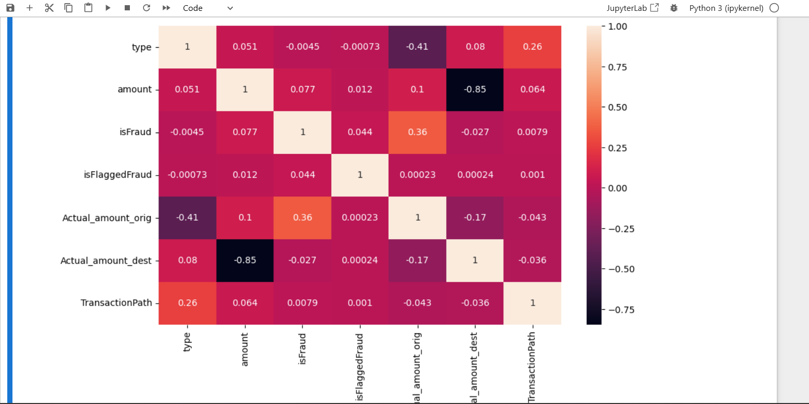
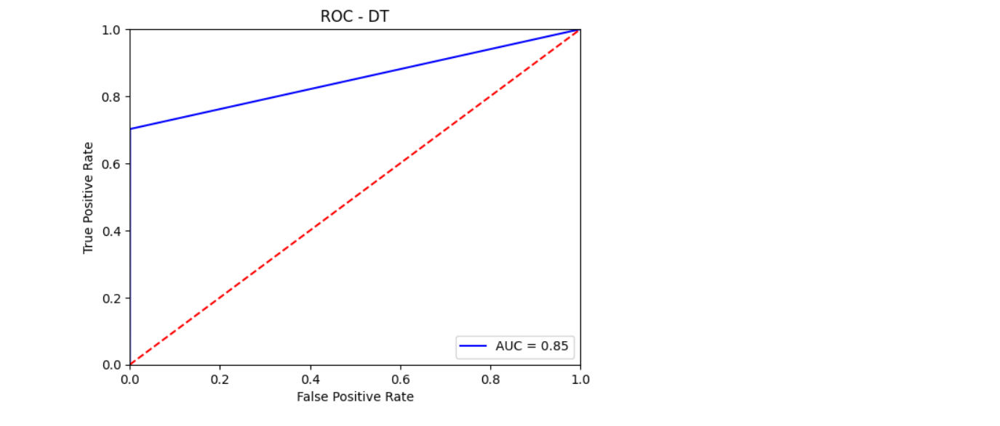

# 🚨 Fraud Detection System

## 📊 Dataset

The dataset includes:
- Transaction type
- Amount
- Origin and destination balances
- Fraudulent and flagged labels

Features are normalized and encoded for effective model training.

## 🧠 Models Used
- Decision Tree
- Random Forest

## 🔍 Correlation Heatmap

Visualizing correlation between features:



## 📈 ROC Curve (Decision Tree)

Performance of the Decision Tree classifier:



## 🧪 Model Accuracy
- Random Forest Accuracy: ~85%
- Decision Tree AUC: 0.85

## 📁 Dataset

The dataset used in this project is hosted externally due to GitHub's file size limitations.

🔗 [Download Fraud.csv from Google Drive](https://drive.google.com/file/d/13dznbI0k7AbWJ4x3qCj3XtQdVQBhqtJe/view?usp=sharing)


## 🛠️ How to Run

```bash
# Clone the repo
git clone https://github.com/yourusername/fraud-detection.git
cd fraud-detection

# Create environment
conda env create -f environment.yml
conda activate fraud-detection

# Run Jupyter Notebook
jupyter lab
